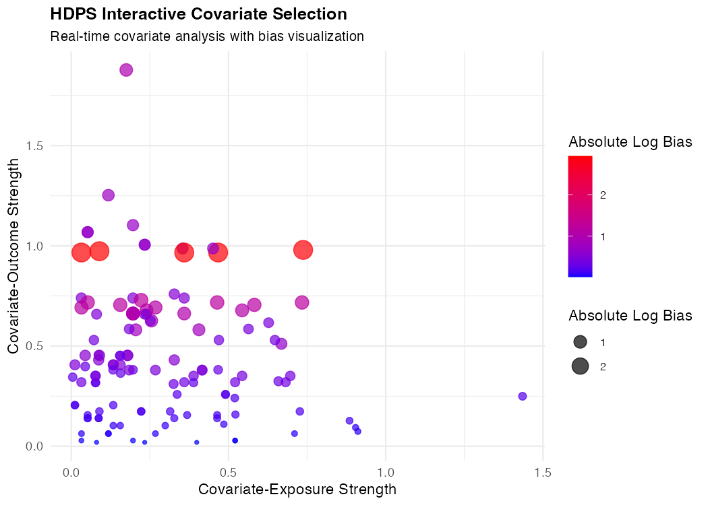
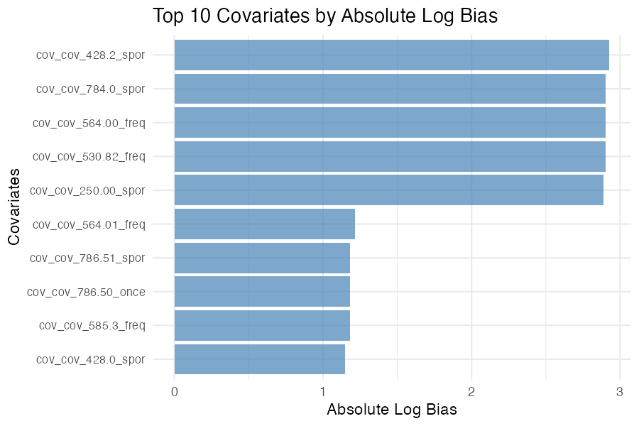
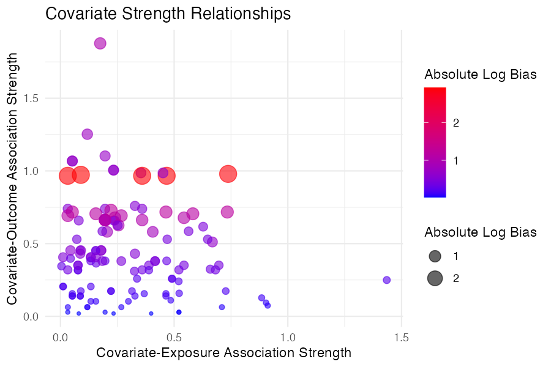
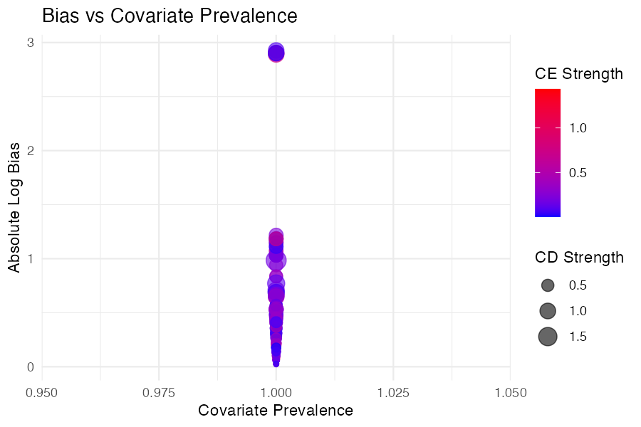

# High-dimensional propensity score (HDPS)

[](https://github.com/Cainefm/hdps/actions)
[](https://opensource.org/licenses/MIT)
[](https://CRAN.R-project.org/package=hdps)

Automated covariate selection for observational studies using the High-Dimensional Propensity Score (HDPS) algorithm. Features modular workflow, parallel processing, interactive visualizations, and comprehensive documentation.

## ✨ Key Features

- **🚀 Modular workflow**: 3-step process (identify → assess → prioritize)
- **⚡ High Performance**: 20-30x speed improvement with optimized algorithms
- **💾 Memory Efficient**: Minimal memory overhead with smart data handling
- **📊 Visualizations**: Interactive plots for bias analysis
- **🔄 Data flexibility**: Multiple input formats (long, wide, matrix)
- **📱 Interactive app**: Shiny interface for covariate selection
- **📚 Documentation**: Comprehensive vignettes and examples

## 📦 Installation

### From GitHub (Development Version)
```r
# Install from GitHub
devtools::install_github("Cainefm/hdps")
```

### From Local Package File
```r
# Install from .tar.gz file
install.packages("hdps_0.9.3.tar.gz", repos = NULL, type = "source")
```

### Dependencies
**Required**: `data.table`, `pbapply`  
**Suggested**: `ggplot2`, `shiny`, `DT`, `testthat`, `knitr`

## 🚀 Quick Start

### 1-Step Workflow
```r
library(hdps)
library(data.table)

# Load your data
data(dx)  # Example diagnosis data
data(master)  # Example master table with exposure/outcome

# Complete HDPS workflow in one function
results <- hdps(
  data = dx,
  id_col = "pid",
  code_col = "icd9code", 
  exposure_col = "exposure",
  outcome_col = "outcome",
  master_data = master,  # Pass master dataset separately
  n_candidates = 200,
  min_patients = 10  # Minimum patients required per covariate
)

# View results
head(results$prioritization)
```

**Sample Output**: 
```
                   code    e1    e0    d1    d0    c1    c0  e1c1  e0c1  e1c0  e0c0  d1c1  d0c1  d1c0  d0c0   pc1   pc0      rrCE       rrCD       bias absLogBias ce_strength cd_strength
                 <char> <int> <int> <int> <int> <int> <int> <int> <int> <int> <int> <num> <num> <num> <num> <num> <num>     <num>      <num>      <num>      <num>       <num>       <num>
 1: cov_cov_250.00_freq   295   705   139   861    34   966    15    19   280   686   4.0  30.0 135.0 831.0 0.034 0.966 1.5220588 0.84183007  1.1740003  0.1604169   0.5220588  0.15816993
 2: cov_cov_250.00_once   295   705   139   861    33   967    18    15   277   690   5.0  28.0 134.0 833.0 0.033 0.967 1.9041680 1.09339665  0.9199933  0.0833889   0.9041680  0.09339665
 3: cov_cov_250.00_spor   295   705   139   861    34   966    17    17   278   688   0.1  34.1 139.1 827.1 0.034 0.966 1.7374101 0.02042542 17.9913866  2.8898931   0.7374101  0.97957458
```

The `prioritization` data.table shows covariates ranked by bias, with columns for bias estimates, prevalence, and strength measures.

### 3-Step Workflow
```r
# Step 1: Identify candidate covariates
candidates <- identify_candidates(dx, "pid", "icd9code", "dx", n = 200, min_patients = 10)

# Step 2: Assess recurrence patterns
recurrence <- assess_recurrence(candidates$data, "pid", "code", "dx")

# Step 3: Prioritize covariates
cohort_data <- merge(recurrence, master, by = "pid", all.x = TRUE)
prioritization <- prioritize(cohort_data, "pid", "exposure", "outcome")
```

### Interactive Analysis
```r
# Launch interactive Shiny app
hdps_interactive()
```

**Interactive Features**: The Shiny app provides real-time covariate selection with interactive plots for bias distribution, covariate strength relationships, and bias vs prevalence analysis.



## 📊 Visualizations

### Bias Distribution Plot
```r
# Plot top covariates by bias
plot_bias_distribution(prioritization, top_n = 20)
```



### Covariate Strength Relationships
```r
# Plot CE vs CD strength relationships
plot_covariate_strength(prioritization)
```



### Bias vs Prevalence
```r
# Create additional visualizations
plot_bias_vs_prevalence(prioritization)
```



## 📚 Documentation

- **Tutorial**: `vignette("hdps-tutorial")`
- **Function Help**: `help(hdps)`
- **Interactive App**: `hdps_interactive()`

## 🧪 Testing

```r
library(testthat)
test_package("hdps")
```

## 📖 Citation

```r
citation("hdps")
```

## 🤝 Contributing

Contributions welcome! See [Contributing Guidelines](CONTRIBUTING.md).

## 🙏 Acknowledgments

- HDPS algorithm by Schneeweiss et al. (2009)